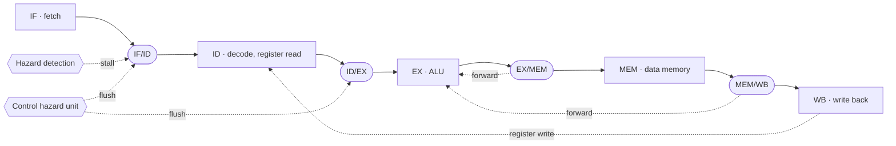

# RISC-V PIPELINE · HARDWARE-SCHEDULED

### Forwarding, stalling and flushing, so unmodified programs just run

**VHDL · RV32I · QuestaSim · Quartus**

Iowa State University · CprE 381 · Project Group F_04

[Overview](#overview) · [Pipeline with hazard handling](#pipeline-with-hazard-handling) · [My role](#my-role) · [Results](#results) · [Limitations](#limitations-and-next-steps)

---

> **Where it stands — Complete**  
> Finishes Mergesort about 20% faster than the single-cycle processor.  
> It misses the 20 ns clock constraint by 5.43 ns; the critical path is described under Limitations.

| Clock period | Max frequency | CPI · Mergesort | Mergesort |
| :---: | :---: | :---: | :---: |
| **25.43 ns** | **39.33 MHz** | **1.31** | **56,327 ns** |
| | |
|---|---|
| Period | November – December 2025 |
| Team | 2 — Jongwoo Kim, Veda Vegiraju (Project Group F_04) |
| My role | Hazard and forwarding logic, pipeline registers with stall/flush, testbenches, benchmarking |
| Stack | VHDL, RISC-V assembly, QuestaSim, Quartus (timing), RARS, course toolflow (Python) |

## Overview

- **Problem:** the software-scheduled pipeline is fast per cycle but only correct if the programmer reorders code and inserts NOPs, which more than doubled the instruction count of our Mergesort benchmark.
- **Approach:** let the hardware resolve hazards, so unmodified programs run correctly.

| Hazard | How it is handled | Module |
|---|---|---|
| Data dependency on a result still in the pipeline | Forward from EX/MEM or MEM/WB to the ALU inputs | `forwarding_unit_all.vhd`, `fwd_mux3.vhd` |
| Load followed by an instruction that uses the value | Stall one cycle | `hazard_detection_unit.vhd` |
| Taken branch or jump | Flush the wrongly fetched instructions | `contro_hazard_unit.vhd` |

Source is in `proj/src/TopLevel/`, testbenches in `proj/test/`.

## Pipeline with hazard handling

## My role

The commits in this repository are mine. I wrote the pipeline registers with stall and flush inputs, the forwarding unit, the hazard detection and control hazard units, and twelve module-level testbenches. I also built the data-hazard test coverage table and ran the benchmarks. The reports were written with my teammate.

## What I learned

**Technical**
- Separating dependencies that forwarding can fix from those that need a stall.
- Deciding which stages to stall and which to flush for each kind of non-sequential PC update.
- Building a coverage table of producer and consumer instruction pairs so hazard tests are systematic.
- Tracing a failing timing path across several modules.

**Teamwork**
- Fixing inter-stage signal names and interfaces first, then working on modules separately.
- Explaining why a result is correct with annotated waveforms.

## Resources used

- Patterson and Hennessy, *Computer Organization and Design: RISC-V Edition*
- Course toolflow (`3810_tf.sh`, `cpre3810-toolflow.pdf`) and lecture material
- QuestaSim, Quartus, RARS

## Results

| Design | Max clock period | Max frequency | CPI (Mergesort) | Mergesort time |
|---|---|---|---|---|
| Single-cycle | 41.40 ns | about 24.2 MHz | about 1.00 | 70,214 ns |
| Software-scheduled pipeline | 16.80 ns | 59.53 MHz | 1.12 | 74,105 ns |
| Hardware-scheduled pipeline | 25.43 ns | 39.33 MHz | 1.31 | 56,327 ns |

The hardware-scheduled pipeline finishes Mergesort about 20% faster than the single-cycle processor and 24% faster than the software-scheduled one.

## Limitations and next steps

- The design misses the 20 ns clock constraint (slack −5.43 ns). The critical path runs EX/MEM → data memory → load extender → ALU input mux → ALU adder and branch compare → next-PC logic → PC, all in one cycle.
- Resolving branches in the ID stage, or splitting that forwarding path, would shorten it.
- The ALU adder is ripple-carry; carry-lookahead would help both pipelines.
- There is no branch prediction, so every taken branch costs a flush.
- The repository contains simulator output (`work/`, `vsim.wlf`, `temp/`) that should be removed and ignored.

## The three processors

This repository is one of three from the same term project.

| Stage | Repository | Max clock period | Max frequency |
|---|---|---|---|
| Single-cycle | [Project-Part-1-RISC-V-Single-cycle-Processor](https://github.com/devjwk/Project-Part-1-RISC-V-Single-cycle-Processor) | 41.40 ns | about 24.2 MHz |
| Software-scheduled pipeline | [Project-Part-2](https://github.com/devjwk/Project-Part-2) | 16.80 ns | 59.53 MHz |
| Hardware-scheduled pipeline | [Project-Part-1](https://github.com/devjwk/Project-Part-1) | 25.43 ns | 39.33 MHz |
